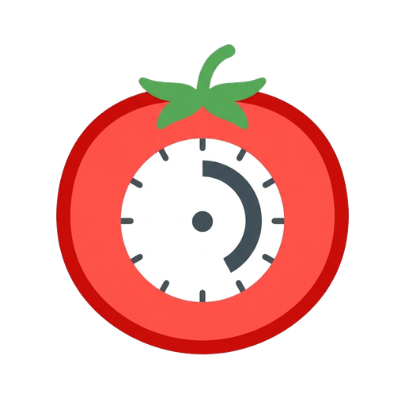

<p align="center">
  
</p>

<h1 align="center">Pomodoro Timer</h1>

<p align="center">
  <strong>Focus tracking as a desktop app.</strong><br/>
  Start a timer, track your tasks, review your stats — done.
</p>

<p align="center">
  
  
  
  
  
</p>

---

## What is Pomodoro Timer?

Pomodoro Timer is a lightweight desktop application for time-boxed focus sessions using the **Pomodoro Technique**.

Work in focused intervals (default 25 minutes), take short breaks in between, and a longer break after every four sessions. Assign tasks to your sessions and track your productivity over time.

**Fully offline.** All data stays local on your machine.

---

## Features

### Circular SVG Timer

A clean, animated countdown circle with large time display. Colors change based on session type — indigo for focus, green for short breaks, amber for long breaks.

### Work / Break Cycles

Automatic transitions between focus sessions and breaks. After a configurable number of focus sessions, a long break is triggered. Sessions can auto-start or wait for manual confirmation.

### Task Management

Create tasks with a target number of pomodoros. Assign a task to the timer — completed pomodoros are automatically counted. Mark tasks as done when finished.

### Weekly Statistics

View your daily pomodoro count in a bar chart (Monday–Sunday). Summary cards show today's and this week's totals. A task breakdown shows which tasks consumed the most focus time.

### Configurable Settings

Adjust focus duration, short break, long break, and sessions before long break. Toggle auto-start, sound notifications, and always-on-top window mode.

### Desktop Notifications & Sound

A two-tone chime plays when a session completes (via Web Audio API). A native desktop notification tells you whether it's time for a break or time to focus.

### Dark & Light Theme

Switch themes with a single button. Your preference is persisted and synced to the native title bar.

### Global Shortcut & Window Toggle

**`Ctrl + 2`** works globally — no matter which window currently has focus:

- **Toggles the timer** (start / pause / resume)
- **Toggles window visibility** — if the app is visible and focused, it hides. Otherwise it pops up, unminimizes, and takes focus.

When a session completes (focus or break), the window **automatically comes to the foreground** — even if it was hidden or minimized. This way you never miss a session transition.

### YouTube Music Player

Play background music from your YouTube playlists during focus sessions. Music starts automatically when a focus session begins and pauses when the session ends or a break starts.

**Features:**

- **Google OAuth login** — Sign in with your Google account to browse and select your personal YouTube playlists
- **Playlist picker** — Visual list of your playlists with thumbnails, titles, and video count
- **URL fallback** — Paste any YouTube playlist URL as an alternative (no login required)
- **Volume control** — Adjustable slider (0–100%)
- **Shuffle mode** — Songs play in random order
- **Skip song** — Jump to the next track
- **Smart video filtering** — Deleted, private, and non-embeddable videos are automatically detected via the YouTube Videos API and excluded before playback
- **Robust error handling** — Unplayable videos are skipped automatically with multiple retry strategies and fallback mechanisms
- **Status feedback** — Real-time display of what's playing, loading state, and error messages

**How it works under the hood:**

1. On login, the app performs an OAuth 2.0 authorization flow via a Tauri plugin, exchanging the auth code for access/refresh tokens
2. Playlists are fetched via the YouTube Data API v3 (`playlistItems` endpoint)
3. Video IDs are batch-verified against the Videos API (`videos?part=id,status`) to filter out deleted, private, or non-embeddable entries
4. A hidden YouTube IFrame player loads the verified video IDs and starts playback in shuffle mode
5. If the video ID method fails, the player falls back to loading by playlist ID

**Required setup:** You need your own Google OAuth client credentials (Client ID + Client Secret) from the [Google Cloud Console](https://console.cloud.google.com/). See the [Setup Guide](#google-oauth-setup) below.

---

## How Does It Work?

```
+----------------+    +--------------------+    +--------------------+
| Timer View     |    | Task List          |    | Statistics         |
|                |    |                    |    |                    |
| SVG Countdown  |    | Add / Edit / Del   |    | Today & Week       |
| Start / Pause  |    | Target Pomodoros   |    | Bar Chart (7 days) |
| Reset / Skip   |    | Progress Tracking  |    | Task Breakdown     |
| Session Pills  |    | Set Active Task    |    |                    |
| Active Task    |    |                    |    |                    |
| Today Stats    |    +--------------------+    +--------------------+
+----------------+
        |
        v
+--------------------+
| Settings           |
|                    |
| Timer Durations    |
| Auto-Start         |
| Sound / On-Top     |
| Music / Playlists  |
+--------------------+
```

### Workflow

1. **Start a focus session** — Hit Start or press `Ctrl+2`. The circular timer counts down from 25 minutes (configurable).
2. **Assign a task** — Click the task card below the timer to select what you're working on. Completed pomodoros are counted automatically.
3. **Take breaks** — When the timer completes, a notification and sound play. The app switches to a break session (short or long depending on the cycle).
4. **Review your stats** — Open Statistics to see your daily and weekly focus summary.

### Timer State Machine

```
idle ──> running ──> paused ──> running ──> (completed)
  ^                                              |
  └──────────────── next session ────────────────┘
```

The timer uses a drift-free approach: instead of decrementing a counter, it stores a `targetEndTime` and computes the remaining seconds on each tick.

### Data Storage

All data is stored exclusively in the **localStorage** of the Tauri WebView — no server, no database, no cloud.

| Key | Content |
|-----|---------|
| `pomo-settings` | Timer configuration incl. music preferences (JSON) |
| `pomo-tasks` | All tasks (JSON) |
| `pomo-sessions` | Completed sessions (JSON, max 500) |
| `pomo-theme` | Active theme (`light` / `dark`) |
| `pomo-google-auth` | Google OAuth tokens for YouTube access (JSON) |

---

## Tech Stack & Architecture

### Architecture Overview

```
+--------------------------------------------+
| Tauri Shell                                |
|                                            |
|  +--------------------------------------+  |
|  | Svelte Frontend                      |  |
|  |                                      |  |
|  |  SvelteKit <--> Svelte Stores        |  |
|  |  (Routing)      (Reactive State)     |  |
|  |      |               |               |  |
|  |      v               v               |  |
|  |  Components      localStorage        |  |
|  |  (UI Layer)      (Persistence)       |  |
|  +--------------------------------------+  |
|                    ^                       |
|                    | IPC (minimal)         |
|  +--------------------------------------+  |
|  | Rust Backend                         |  |
|  |                                      |  |
|  |  Window Management (show/hide/focus) |  |
|  |  Global Shortcut (Ctrl+2)            |  |
|  |  Desktop Notifications               |  |
|  |  Native Title Bar & Theme Sync       |  |
|  |  Google OAuth Flow                   |  |
|  +--------------------------------------+  |
+--------------------------------------------+
```

### Frontend

| Technology | Version | Role |
|------------|---------|------|
| **Svelte** | 5 | Reactive UI framework — components, transitions, store bindings |
| **SvelteKit** | 2.9 | Meta-framework with routing and static adapter (SPA mode) |
| **TypeScript** | 5.6 | Type safety for interfaces, stores, and utility functions |
| **Vite** | 6 | Lightning-fast dev server with HMR and optimized production builds |

**State management** is handled through custom Svelte stores in `store.ts`. Each store (Settings, Tasks, Sessions, Timer, Google Auth, Music Player) encapsulates load, save, and mutation logic, automatically persisting changes to localStorage. Derived stores like `todayStats`, `weekStats`, and `musicShouldPlay` reactively compute their values from the base stores.

**View routing** is controlled in `+page.svelte` via a simple state variable (`view: "timer" | "tasks" | "stats" | "settings"`) — no URL-based routing needed since the app is a single-window desktop tool.

### Backend (Rust / Tauri)

| Technology | Version | Role |
|------------|---------|------|
| **Tauri** | 2 | Desktop runtime — bundles the frontend into a native window |
| **Rust** | Edition 2021 | Compiled backend for window control and shortcut handling |
| **serde / serde_json** | 1 | Serialization for IPC communication |

The Rust backend is intentionally minimal. It only handles tasks that a pure web frontend cannot:

- **Global shortcut** (`Ctrl+2`): Registers system-wide, toggles timer AND window visibility (show/hide/focus/unminimize), emits `toggle-timer` event to the frontend
- **Window management**: Show, hide, unminimize, and focus the window — used by the shortcut handler and the frontend's session-complete callback
- **Theme sync**: Sets the native title bar theme to match the app theme
- **Google OAuth flow**: Spins up a temporary local HTTP server, opens the browser for Google consent, and captures the authorization code
- **Plugin initialization**: Activates the `global-shortcut`, `notification`, and `opener` plugins on startup

All business logic — timer management, task tracking, statistics — runs entirely in the frontend.

### How They Work Together

1. **Tauri** launches a native window and loads the **SvelteKit** frontend built by **Vite**
2. **SvelteKit** renders the UI as a single-page app (static adapter, SSR disabled)
3. **Svelte Stores** load data from **localStorage** and maintain the reactive state
4. User interactions flow through **Svelte components** → **store mutations** → **localStorage persistence**
5. For native features (shortcut, notifications, title bar), the frontend communicates with the **Rust backend** via **Tauri IPC**

---

## Project Structure

```
pomodoro-app/
├── src/                          # Frontend source code
│   ├── routes/                   # SvelteKit pages
│   │   ├── +page.svelte          # Main view router
│   │   ├── +layout.svelte        # Theme setup & title bar sync
│   │   └── +layout.ts            # SPA configuration (SSR disabled)
│   ├── lib/                      # Components & state
│   │   ├── types.ts              # TypeScript interfaces & defaults
│   │   ├── store.ts              # Svelte stores, timer state machine, Google Auth, utilities
│   │   ├── Timer.svelte          # Circular countdown, controls, session pills
│   │   ├── TaskList.svelte       # Task CRUD, progress tracking
│   │   ├── Statistics.svelte     # Weekly bar chart, task breakdown
│   │   ├── Settings.svelte       # Configuration panel (incl. music settings)
│   │   ├── YouTubePlayer.svelte  # Hidden YouTube IFrame player, playlist loading, error handling
│   │   └── PlaylistPicker.svelte # Google login, playlist browser, URL input
│   ├── app.css                   # Global styles (light/dark themes)
│   └── app.html                  # HTML shell
│
├── src-tauri/                    # Rust backend
│   ├── src/
│   │   ├── main.rs               # Entry point
│   │   └── lib.rs                # App setup (shortcuts, notifications, theme)
│   ├── Cargo.toml                # Rust dependencies
│   ├── tauri.conf.json           # App configuration (window, icons, ID)
│   ├── icons/                    # App icons (PNG, ICO, ICNS)
│   └── capabilities/             # Tauri security policies
│
├── package.json                  # Scripts & frontend dependencies
├── vite.config.js                # Vite configuration
├── svelte.config.js              # SvelteKit configuration
├── tsconfig.json                 # TypeScript configuration
└── LICENSE                       # MIT License
```

---

## Development

### Prerequisites

- [Node.js](https://nodejs.org/) (LTS)
- [Rust](https://www.rust-lang.org/tools/install)
- [Tauri CLI](https://tauri.app/start/)

### Getting Started

```bash
# Install dependencies
npm install

# Start dev server (frontend only, http://localhost:1420)
npm run dev

# Start full desktop app in dev mode
npm run tauri dev
```

### Building

```bash
# Build frontend
npm run build

# Build complete desktop app (installer + executable)
npm run tauri build
```

### Type Checking

```bash
npm run check         # One-time
npm run check:watch   # Continuous
```

---

## Google OAuth Setup

The YouTube Music Player requires Google OAuth credentials. These are **not included** in the repository — you need to create your own.

### Step-by-Step

1. **Go to the Google Cloud Console**
   - Open [console.cloud.google.com](https://console.cloud.google.com/)
   - Sign in with your Google account

2. **Create a project** (or select an existing one)
   - Click the project dropdown at the top left
   - Click "New Project", give it a name (e.g. "Pomodoro Timer"), click "Create"

3. **Enable the YouTube Data API v3**
   - Go to "APIs & Services" > "Library"
   - Search for "YouTube Data API v3"
   - Click on it and hit "Enable"

4. **Configure the OAuth consent screen**
   - Go to "APIs & Services" > "OAuth consent screen"
   - Choose "External" as user type
   - Fill in the required fields (App name, User support email, Developer contact email)
   - Under "Scopes", add: `https://www.googleapis.com/auth/youtube.readonly`
   - Under "Test users", add your own Google email address
   - Click through to finish

5. **Create OAuth credentials**
   - Go to "APIs & Services" > "Credentials"
   - Click "Create Credentials" > "OAuth client ID"
   - Application type: **Web application**
   - Name: anything (e.g. "Pomodoro Timer")
   - Authorized redirect URIs: add `http://localhost` (required for the Tauri OAuth flow)
   - Click "Create"
   - You'll see your **Client ID** and **Client Secret** — copy both

6. **Add credentials to the project**
   - Create a file `.env` in the `pomodoro-app/` root directory:

   ```
   VITE_GOOGLE_CLIENT_ID=your-client-id-here.apps.googleusercontent.com
   VITE_GOOGLE_CLIENT_SECRET=GOCSPX-your-secret-here
   ```

   - This file is in `.gitignore` and will not be committed

7. **Done!** Start the app with `npm run tauri dev` and you can log in via Google in the Settings > Music section.

> **Important:** Never commit your `.env` file or share your Client Secret publicly. If you accidentally expose it, go back to the Google Cloud Console and regenerate the credentials.

---

## License

GPL-3.0 — see [LICENSE](LICENSE)

<p align="center"><sub>Built with Tauri, Svelte, and a pinch of Rust.</sub></p>
